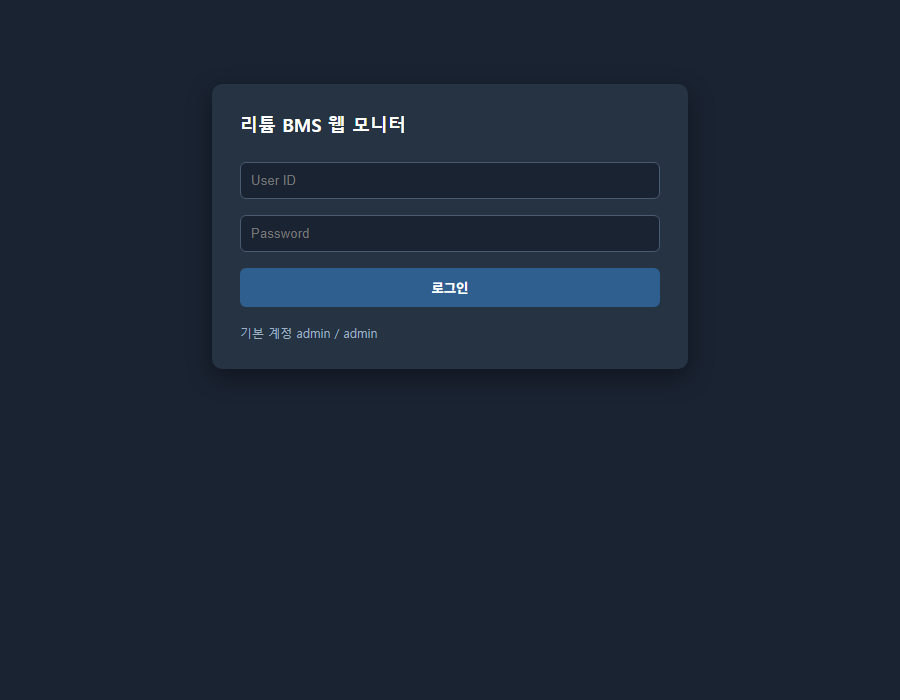
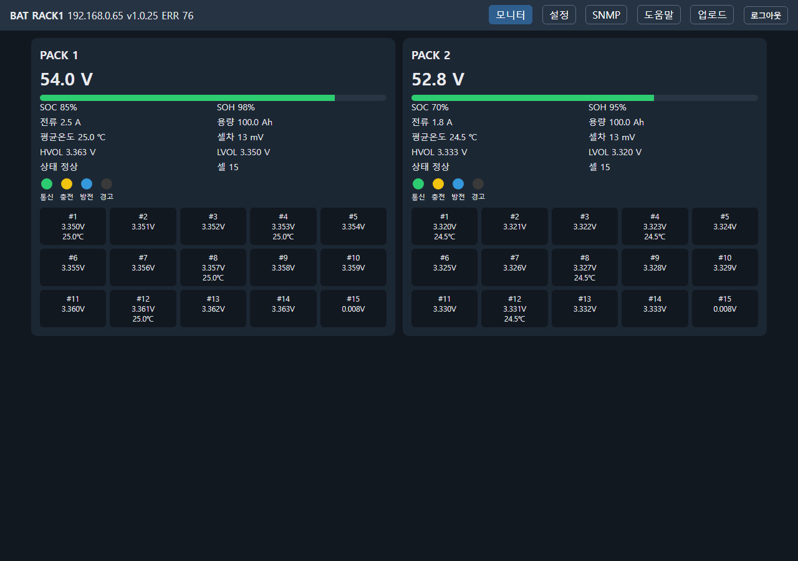
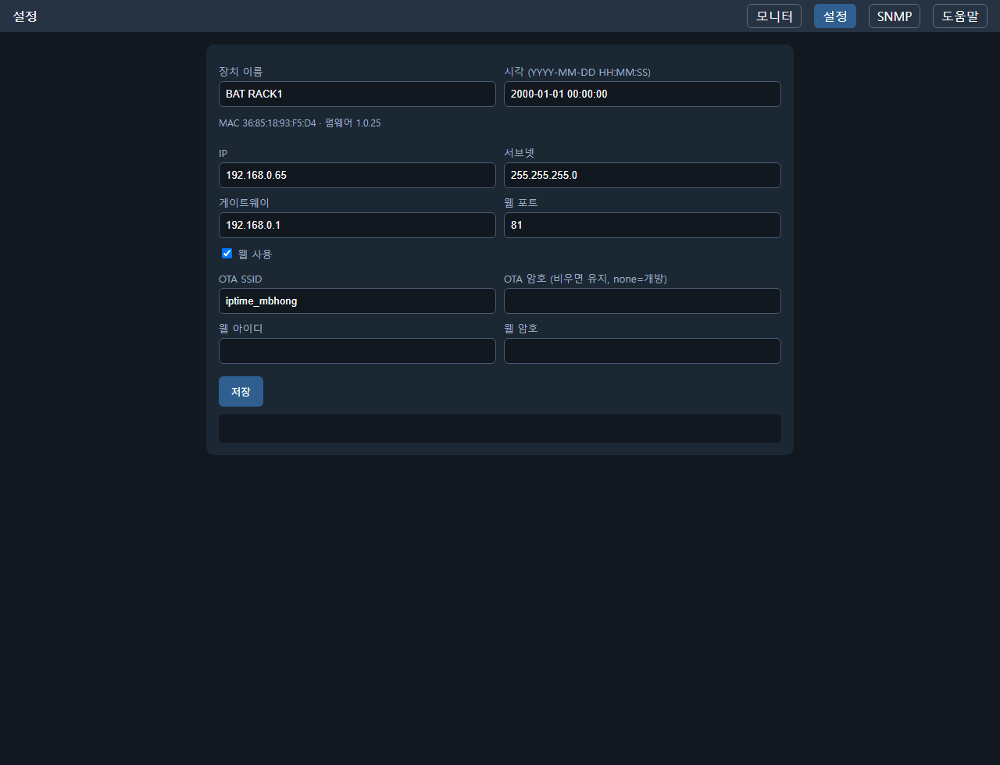
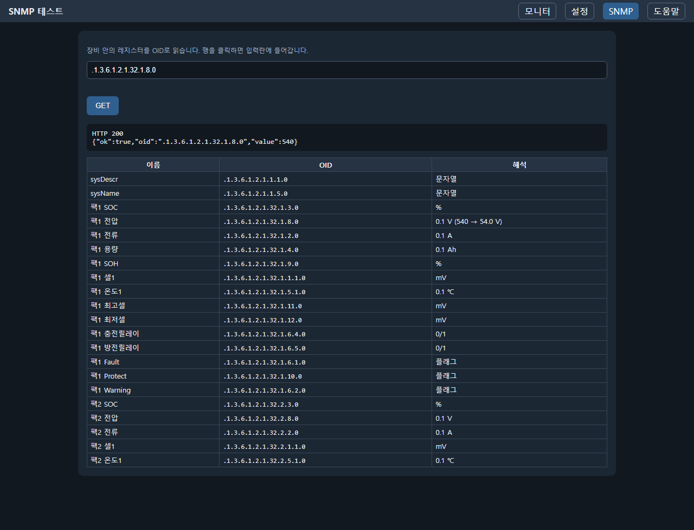
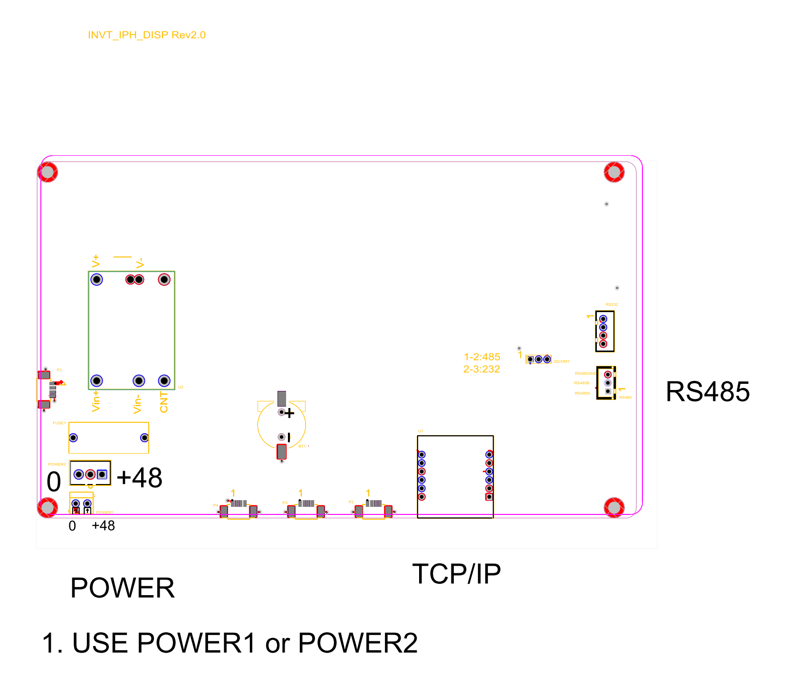

# 삼우 리튬 배터리 디스플레이 (SunElec / Samwoo)

Sunton ESP32-8048S070 (ESP32-S3, 7인치 RGB 터치)입니다. RS-485로 삼우 리튬 팩 2대를 읽고, 화면·웹·SNMPv2c로 값을 보여 줍니다.  
펌웨어 현장 업데이트는 **앱(BLE) → 재부팅 → Wi‑Fi OTA** 입니다. 유선 이더넷은 SNMP·웹·IPFinder용이며 OTA에는 쓰지 않습니다.

현재 펌웨어 버전은 `Version.h`를 보면 됩니다. `esp32_samwoo` 빌드마다 patch가 1 올라갑니다.

사용자 매뉴얼 (HTML·인쇄·PDF): [doc/사용설명서/manual/사용설명서.html](doc/사용설명서/manual/사용설명서.html)  
현장 업데이트 요약: [upgradeDoc/upgradeManual.md](upgradeDoc/upgradeManual.md)

---

## 1. 목적

- 팩 1·2의 전압·전류·셀·온도를 7인치 화면에 표시한다.
- 이더넷이 있으면 SNMPv2c(UDP 161, community `public`)와 웹 모니터(공장 포트 **80**, `WEBSERVERPORT=0`이면 끔)로 같은 값을 제공한다.
- 같은 랜에서 IP Finder(`python/release/IPFinder.exe` 또는 `python/SnmpFinder.py`)가 UDP **1234**로 검색하면 응답하고, IP/서브넷/게이트웨이/웹 on·off·포트를 바꿀 수 있다.
- 앱 `IFTECH SAMWOO` (BLE `IFTECH_SW_<MAC>`)로 SSID를 넣고, 재부팅 후 Wi‑Fi로 펌웨어를 받는다.

---

## 2. 구조

```
src/                   펌웨어 (main.cpp, SquareUi, 삼우 폴링, SNMP, 웹, BLE, OTA)
lib/                   LVGL, GFX, Arduino_SNMP, Ethernet_Generic …
UploadFiles/           웹 HTML/CSS/JS (SPIFFS)
mib/                   SAMWOO_BAT_MIB_VER_01.MIB
doc/사용설명서/manual/ HTML 사용설명서 · make_pdf.ps1 · 캡처
manual/                사용자 매뉴얼 포인터
upgradeDoc/            현장 펌웨어 업그레이드 요약
python/                IP Finder 소스·exe, 웹 업로드, 스모크/소크
python/release/        IPFinder.exe
IFTECH_SAMWOO_App/     BLE + OTA용 Flutter 앱
IFTECH_SAMWOO_App/release/  배포 APK
doc/                   보드 DXF
doc/readme/            README용 캡처·도면 PNG
Version.h              활성 VERSION + 주석 이력
pre_build.py           빌드 시 patch +1
post_build.py          firmware.bin / esp32_samwoo.json → IIS + uploadFirmware/
```

| 경로 | 역할 |
|------|------|
| `src/main.cpp` | 부팅. `isUpdate`면 BLE보다 먼저 Wi‑Fi OTA |
| `src/SquareUi/` | SquareLine Expert 내보내기 (셀 16 포함) |
| `src/samwoo_poll.cpp` | 슬레이브 1·2 RS-485 폴링 |
| `src/snmp_battery.cpp` | SNMPv2c |
| `src/eth_w610.cpp` | W6100 + 웹 HTTP (같은 TU) |
| `src/web_impl.inc` | 웹 라우트·API |
| `src/ip_finder.cpp` | IPFinder UDP 1234 |
| `src/wifiOTA.cpp` | STA 연결 + SelfUploader |
| `src/myBlueTooth.cpp` | BLE Nordic UART |
| `src/cli_commands.cpp` | `ssid` / `pass` / `update` / `version` |
| `platformio.ini` | env `esp32_samwoo` |

---

## 3. 동작 방식

1. ESP32-S3가 RGB 패널을 직접 구동하고 LVGL로 그린다. 화면 백라이트는 항상 켜져 있다.
2. Serial1 RS-485로 삼우 팩 주소 1·2를 폴링한다 (19200 8N1, 표준 Modbus가 아님).
3. 유선 랜이 있으면 W6100으로 SNMP(UDP 161), IPFinder(UDP 1234), 웹(EEPROM 포트)을 연다. HTML은 SPIFFS이며 `/fileUpload` 로 올린다. 주소는 대소문자를 가리지 않는다. 로그인 기본값 `admin` / `admin`.
4. BLE로 `update`를 받으면 `isUpdate`만 저장하고 재부팅한다. **BLE와 Wi‑Fi를 동시에 켜지 않는다.**
5. 재부팅 직후 Wi‑Fi로 `{FW_UPDATE_BASE}/{FW_UPDATE_META}` 를 보고, `latest`가 장치 `VERSION`보다 크면 펌웨어를 받아 플래시한다.
6. 웹·SNMP·IPFinder는 `loop()`에서만 W6100 SPI를 쓴다. RS-485는 `samwooPollTick()` (논블로킹).

빌드 env:

| env | 용도 |
|-----|------|
| `esp32_samwoo` | 제품 펌웨어 (기본) |
| `hwtest_rtc` / `hwtest_rs485` / `hwtest_w610` | 칩 단독 확인 |

OTA 메타 파일: **`esp32_samwoo.json`**  
공개 URL: `http://ift.iptime.org:80/Esp32UploadFirmware/`

---

## 4. 펌웨어 빌드 · 업로드

```
pio run -e esp32_samwoo
pio run -e esp32_samwoo -t upload
```

업로드 포트는 `COM3`. 매 빌드마다 `Version.h` patch가 올라가므로 불필요한 빌드는 하지 않는다.

한 방 (펌웨어 + 웹 HTML + 웹/팩1·2/SNMP):

```
python python/deploy_and_test.py --host 192.168.0.65 --port 80
```

산출물 (IIS 및 `uploadFirmware/`):

- `firmware_<version>_esp32_samwoo.bin`
- `firmware.bin`
- `esp32_samwoo.json` — `{ "latest": "x.y.z", "filename": "firmware_x.y.z_esp32_samwoo.bin" }`

파티션: `default_8MB.csv` (`app0`/`app1` OTA, `spiffs` 1.5MB).

---

## 5. 앱 빌드 · 배포

Flutter 앱 **IFTECH SAMWOO**. 패키지 `com.iftech.iftech_samwoo_app`.  
장비 BLE 이름: `IFTECH_SW_<MAC>`.

```
cd IFTECH_SAMWOO_App
.\build_release.ps1
```

또는

```
flutter pub get
flutter build apk --release
```

배포 파일: [`IFTECH_SAMWOO_App/release/IFTECH_SAMWOO_App.apk`](IFTECH_SAMWOO_App/release/IFTECH_SAMWOO_App.apk) (약 47MB).  
휴대폰에 복사해 설치한다. 알 수 없는 출처 허용이 필요하다.

연결 후 **Wi-Fi 설정**에서 AP를 넣고 **SSID / PASS 장비로 전송**, 그다음 **update**. 재접속 후 **version**.  
자세한 단계는 [사용설명서.html](doc/사용설명서/manual/사용설명서.html) 제4부.

---

## 6. CLI (USB Serial 또는 BLE)

| 명령 | 동작 |
|------|------|
| `version` | `VERSION : x.y.z` |
| `ssid` | 저장된 SSID/PASS 표시 |
| `ssid 이름` | 핫스팟/AP SSID 저장 |
| `pass 암호` | 비밀번호 저장 (`none`이면 개방) |
| `ip` | 저장 IP/SN/GW + 현재 이더넷 |
| `ip a.b.c.d [sn gw]` | 이더넷 주소 저장 (reboot 후 적용) |
| `time` | DS1307 RTC 시각 |
| `time Y M D h m s` | RTC 설정 |
| `name` / `name 텍스트` | 화면 장치 이름 |
| `status` | 팩1·2 통신/SOC/전압/전류 |
| `mac` | WIFI / ETH MAC |
| `update` | `isUpdate=true` 후 재부팅 → Wi‑Fi OTA |
| `reboot` | 재부팅 |
| `help` | 명령 목록 |

---

## 7. 웹

공장 포트 **80**. 로그인 `admin` / `admin`.

| 페이지 | 내용 |
|--------|------|
| `/` `index.html` | 팩 2대 모니터 (7인치와 같은 항목) |
| `settings.html` | IP, 이름, 시각, 웹, OTA Wi‑Fi, 계정 |
| `snmpTest.html` | 내부 레지스터 OID 조회 |
| `/fileUpload` | HTML 업로드 (펌웨어에 내장) |

HTML은 `UploadFiles/` 만 올린다. `fileUpload.html` / jQuery / svg 는 넣지 않는다.

```
python python/upload_web.py --host 192.168.0.65 --port 80
python python/check_bms_web.py --host 192.168.0.65 --port 80
python/release/IPFinder.exe
python python/SnmpFinder.py
```

상세: [python/README.md](python/README.md)

### 웹 화면 (장비에서 캡처)

로그인·모니터·설정·SNMP·도움말은 사용설명서와 같습니다.









---

## 8. SNMP

기본 IP `192.168.0.57`, community `public`, UDP 161.  
팩1 `1.3.6.1.2.1.32.1` / 팩2 `1.3.6.1.2.1.32.2`. MIB: `mib/SAMWOO_BAT_MIB_VER_01.MIB`.

```
python python/snmp_check.py 192.168.0.65
```

---

## 9. Python 도구 · 벤치

실행 방법은 [python/README.md](python/README.md).

스모크 (`check_bms_web.py`, 호스트 192.168.0.65:80):

- `GET /Login.html` 200, 로그인 200
- `/api/bms` 팩1·팩2 `ok=true` (시뮬레이터: 54.0 V / 52.8 V)
- `GET /INDEX.HTML` 200 (대소문자 무시)
- SNMP `1.3.6.1.2.1.32.1.8.0` = 540

소크 (`soak_bms.py`, HTTP 2초 + SNMP 주기, 로그는 gitignore):

- 약 13분 시점 `n=380`, `http_err=0`, `snmp_err=0`
- HTTP 응답 대략 20–40 ms

웹·SNMP·IPFinder는 별도 이더넷 태스크가 없다. `/api/snmp-get` 은 UDP를 다시 열지 않고 `samwooRegs` 를 읽는다.

```
python -u python/soak_bms.py --host 192.168.0.65 --port 80 --hours 1
```
---

## 10. 보드 도면

원본 DXF: [doc/BoardInterface.dxf](doc/BoardInterface.dxf)  
렌더: 

전원(0 / +48), TCP/IP(이더넷), RS-485 커넥터가 표시되어 있다.
