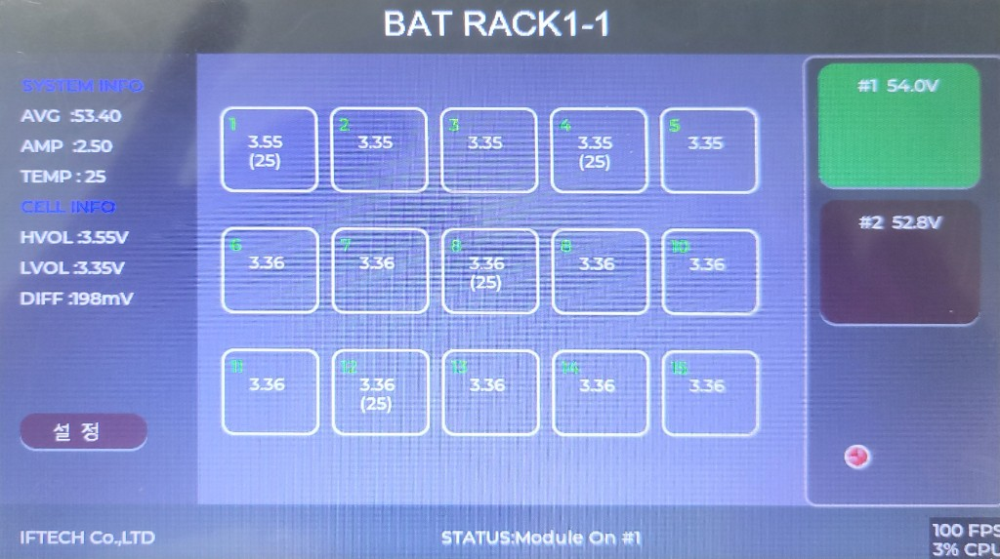

# 삼우 리튬 배터리 디스플레이 사용자 매뉴얼

**제품:** 7인치 터치 디스플레이 (팩 1·팩 2 감시)  
**제조:** IFTECH Co.,LTD  
**문서:** 사용자용 · VER 01

이 문서는 현장 운전·점검을 위한 설명입니다. 화면을 보고 상태를 확인하고, 네트워크를 맞추고, 상위 NMS로 SNMP 값을 읽는 방법을 다룹니다.

---

## 1. 이 장비가 하는 일

디스플레이는 RS-485로 **삼우 리튬 팩 2대**(슬레이브 주소 1, 2)를 읽고, 7인치 화면에 전압·전류·온도를 보여 줍니다. 이더넷으로는 **SNMPv2c**를 제공하므로 상위 감시반에서 같은 값을 읽을 수 있습니다.

| 항목 | 내용 |
|---|---|
| 배터리 | 삼우 리튬 팩 2대 |
| 화면 | 7인치 컬러 터치 |
| 통신(배터리) | RS-485, 9600 8N1 |
| 통신(상위) | 이더넷, SNMPv2c UDP 161 |
| 기본 IP | 192.168.0.57 / 255.255.255.0 / 게이트웨이 192.168.0.1 |

---

## 2. 메인 화면

전원을 켜면 아래와 같은 메인 화면이 나옵니다. 화면 값은 약 **2초**마다 갱신됩니다.

### 2.1 상단 제목

가운데 제목은 **장치 이름 + 선택한 팩 번호**입니다.

예: `BAT RACK1-1` → 장치 이름 `BAT RACK1`, 지금 보고 있는 팩이 **1번**.

장치 이름은 설정 화면에서 바꿀 수 있습니다.

### 2.2 왼쪽 — SYSTEM INFO / CELL INFO

지금 선택한 팩(초록색 버튼) 기준입니다.

| 표시 | 의미 |
|---|---|
| **AVG** | 연결된 팩들의 팩 전압 평균 (V) |
| **AMP** | 선택한 팩의 전류 (A). 충전·방전 방향은 BMS 부호를 따름 |
| **TEMP** | 선택한 팩의 온도 평균 (°C) |
| **HVOL** | 셀 중 가장 높은 전압 (V) |
| **LVOL** | 셀 중 가장 낮은 전압 (V) |
| **DIFF** | HVOL − LVOL (mV). 셀 간 편차 |

**설 정** 버튼을 누르면 설정 화면으로 이동합니다.

### 2.3 가운데 — 셀 1 ~ 15

선택한 팩의 셀 전압입니다. 단위는 **V**입니다.

일부 칸에는 전압 아래 `(25)`처럼 온도(°C)가 같이 나옵니다.

| 칸 | 온도 |
|---|---|
| 셀 1 | 온도 센서 1 |
| 셀 4 | 온도 센서 2 |
| 셀 8 | 온도 센서 3 |
| 셀 12 | 온도 센서 4 |

나머지 칸은 전압만 표시합니다. 화면에는 셀 15칸까지 보입니다.

### 2.4 오른쪽 — 팩 선택

| 버튼 | 의미 |
|---|---|
| **#1 54.0V** | 팩 1 전압. **초록색**이면 지금 가운데에 이 팩이 표시됨 |
| **#2 52.8V** | 팩 2 전압. 어두운 색이면 선택되지 않음 |

버튼을 누르면 가운데·왼쪽 정보가 해당 팩으로 바뀝니다. 제목 끝 숫자(`-1` / `-2`)와 하단 `STATUS: Module On #1`도 같이 바뀝니다.

### 2.5 빨간 점

화면 위에 작은 **빨간 원**이 보이면 지금 손가락이 닿은 위치입니다. 터치 확인용이며 버튼을 가리지 않습니다. 오래 화면을 안 만지면 사라집니다.

### 2.6 하단 표시

| 위치 | 내용 |
|---|---|
| 왼쪽 | IFTECH Co.,LTD |
| 가운데 | `STATUS: Module On #1` 또는 `Module Off #n` — 선택한 팩의 RS-485 통신 상태 |
| 오른쪽 | 화면 성능(FPS, CPU). 운전 값 아님 |
| 회사명과 STATUS 사이 | 상태 램프 4개 (아래 3장) |

`Module On`이면 그 팩 응답이 정상입니다. `Module Off`이면 그 팩과 통신이 안 된 상태입니다. 마지막에 받은 값은 화면에 남을 수 있습니다.

---

## 3. 상태 램프

하단 **통신 / 충전 / 방전 / 경고** 네 개입니다. 꺼져 있으면 회색, 켜져 있으면 색이 들어갑니다.

| 램프 | 색 | 켜질 때 |
|---|---|---|
| **통신** | 초록 | 팩 1 또는 팩 2에서 방금 정상 응답을 받았을 때 (짧게 점멸) |
| **충전** | 노랑 | 팩 1 또는 팩 2의 충전 릴레이가 켜져 있을 때 |
| **방전** | 파랑 | 팩 1 또는 팩 2의 방전 릴레이가 켜져 있을 때 |
| **경고** | 빨강 | 팩 1 또는 팩 2의 고장·보호·경고 플래그가 하나라도 0이 아닐 때 |

충전과 방전이 동시에 켜질 수 있습니다. BMS 릴레이 비트를 그대로 보여 주기 때문입니다.

경고가 켜지면 해당 팩을 선택해 셀 편차(DIFF)·온도를 확인하고, 상위 NMS의 Fault / Protect / Warning 값을 같이 보시면 됩니다.

---

## 4. 설정 화면

메인에서 **설 정**을 누릅니다. 제목은 `BMS SETTING`입니다.

### 4.1 바꿀 수 있는 항목

| 항목 | 설명 |
|---|---|
| **IPADDRESS** | 이 디스플레이의 고정 IP (네 칸) |
| **SUBNET** | 서브넷 마스크 |
| **GATEWAY** | 게이트웨이 |
| **Device Name** | 메인 상단 제목에 쓰는 이름 (예: BAT RACK1) |

칸을 누르면 화면 아래 키보드가 나옵니다. 숫자·이름을 입력한 뒤 빈 곳을 누르면 키보드가 내려갑니다.

### 4.2 버튼

| 버튼 | 동작 |
|---|---|
| **저 장** | 위 값을 내부에 저장합니다. 저장 후 재기동이 필요할 수 있습니다. |
| **메 인** | 저장하지 않고 메인 화면으로 돌아갑니다. |

IP를 바꿨으면 저장 후, PC·NMS의 주소도 새 IP로 맞추십시오. 공장 기본은 **192.168.0.57**입니다.

Date Time 칸은 화면에 있으나, 이 버전에서는 운전용 시계로 쓰지 않습니다.

---

## 5. 일상 운전

1. 전원과 이더넷, RS-485가 연결된 것을 확인합니다.
2. 통신 램프가 간헐적으로 초록으로 깜빡이는지 봅니다.
3. `#1`, `#2`를 눌러 두 팩 전압이 나오는지 확인합니다.
4. DIFF가 갑자기 커지거나 경고 램프가 켜지면 해당 팩의 셀·온도를 확인합니다.
5. 하단이 `Module Off`이면 그 팩의 전원, 주소(1 또는 2), RS-485 배선·종단을 확인합니다.

터치가 잘 안 되면 화면을 다시 눌러 보십시오. 커서가 손가락 위치를 따라가면 터치는 동작 중인 것입니다.

---

## 6. SNMP (상위 감시)

NMS·MIB 브라우저에서 이 디스플레이를 감시할 때 사용합니다.

| 항목 | 값 |
|---|---|
| 프로토콜 | SNMPv2c |
| 포트 | UDP **161** |
| Community (읽기) | `public` |
| 기본 장비 IP | 192.168.0.57 |
| 팩 1 | `1.3.6.1.2.1.32.1` |
| 팩 2 | `1.3.6.1.2.1.32.2` |

MIB 파일은 프로젝트 `mib/SAMWOO_BAT_MIB_VER_01.MIB` 입니다. NMS에 이 파일을 넣은 뒤 위 트리를 Walk 하면 됩니다.

### 6.1 자주 쓰는 값 (팩 1 기준, 끝 `.0`)

| OID | 내용 | 단위 |
|---|---|---|
| `1.3.6.1.2.1.32.1.3.0` | SOC | % |
| `1.3.6.1.2.1.32.1.8.0` | 팩 전압 | 0.1 V (예: 540 → 54.0 V) |
| `1.3.6.1.2.1.32.1.2.0` | 전류 | 0.1 A |
| `1.3.6.1.2.1.32.1.1.1.0` | 셀 1 전압 | mV |
| `1.3.6.1.2.1.32.1.5.1.0` | 온도 1 | 0.1 °C |

팩 2는 `32.1`을 `32.2`로 바꾸면 됩니다.

Walk는 `pack1Value`, `pack2Value`, `batStatus`, `batCommon` 단위로 하면 끝에서 멈춥니다. 트리 끝의 0 값은 종결용이며 배터리 데이터가 아닙니다.

---

## 7. 이상이 있을 때

| 증상 | 확인할 것 |
|---|---|
| 화면은 켜지나 `#1` `#2`가 `--V` | RS-485 배선, BMS 전원, 슬레이브 주소 1·2, 9600 8N1 |
| 한쪽만 `Module Off` | 해당 팩 주소·케이블. 다른 팩은 정상일 수 있음 |
| 통신 램프가 전혀 안 깜빡임 | RS-485 전체가 끊긴 상태 |
| 경고 램프 점등 | 해당 팩 Fault / Protect / Warning. 셀 DIFF·온도 확인 |
| NMS가 안 붙음 | PC와 같은 대역인지, ping 192.168.0.57, UDP 161, community `public` |
| ping은 되는데 SNMP 없음 | 케이블·허브는 정상이고 에이전트만 문제. 전원 재투입 후 재시도 |
| 설정 저장 후 접속이 안 됨 | 새로 넣은 IP로 접속. 잘못 넣었으면 현장 기본 IP 복구가 필요할 수 있음 |
| 터치 위치와 커서가 어긋남 | 화면을 다시 눌러 확인. 커서가 따라오면 동작 중 |

---

## 8. 기본값 일람

| 항목 | 기본값 |
|---|---|
| 장치 이름 | BAT RACK1 |
| IP | 192.168.0.57 |
| 서브넷 | 255.255.255.0 |
| 게이트웨이 | 192.168.0.1 |
| SNMP community | public |
| SNMP 포트 | 161 |
| RS-485 | 9600, 8N1 |
| 팩 주소 | 1, 2 |

문의: IFTECH Co.,LTD
